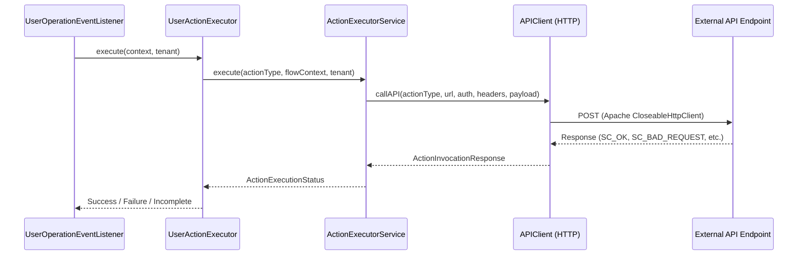

# Flow Execution: External Validation & Endpoint Invocations

This document describes how the WSO2 Flow Execution Engine routes, triggers, and executes external endpoint callouts (such as REST APIs/webhooks) for flow validation, claim checks, and self-registration/user operations.

---

## 1. Flow Execution Routing Engine
When a user flow (such as self-registration or credential recovery) is triggered at runtime:

1. **Service Entry Point**: The flow is initiated via [FlowExecutionService.executeFlow](file:///Users/mahimam/Desktop/wso2/carbon-identity-framework/components/flow-orchestration-framework/org.wso2.carbon.identity.flow.execution.engine/src/main/java/org/wso2/carbon/identity/flow/execution/engine/FlowExecutionService.java#L79-L170).
2. **Engine Processing**: Control is handed off to [FlowExecutionEngine.execute](file:///Users/mahimam/Desktop/wso2/carbon-identity-framework/components/flow-orchestration-framework/org.wso2.carbon.identity.flow.execution.engine/src/main/java/org/wso2/carbon/identity/flow/execution/engine/core/FlowExecutionEngine.java#L83-L157) which processes the configured node graph sequentially.
3. **Task Nodes**: When the engine encounters a node of type `TASK_EXECUTION`, it routes the execution to [TaskExecutionNode.execute](file:///Users/mahimam/Desktop/wso2/carbon-identity-framework/components/flow-orchestration-framework/org.wso2.carbon.identity.flow.execution.engine/src/main/java/org/wso2/carbon/identity/flow/execution/engine/graph/TaskExecutionNode.java#L68-L76).
4. **Dynamic OSGi Executors**: [TaskExecutionNode](file:///Users/mahimam/Desktop/wso2/carbon-identity-framework/components/flow-orchestration-framework/org.wso2.carbon.identity.flow.execution.engine/src/main/java/org/wso2/carbon/identity/flow/execution/engine/graph/TaskExecutionNode.java#L106-L129) dynamically queries registered OSGi components implementing the [Executor](file:///Users/mahimam/Desktop/wso2/carbon-identity-framework/components/flow-orchestration-framework/org.wso2.carbon.identity.flow.execution.engine/src/main/java/org/wso2/carbon/identity/flow/execution/engine/graph/Executor.java) interface (e.g., custom executors like `KYBVerificationExecutor`).

---

## 2. External Actions Framework & HTTP Invocations
To invoke external endpoints (REST APIs) for validating specific claims or profile changes, the system uses the [action-mgt](file:///Users/mahimam/Desktop/wso2/carbon-identity-framework/components/action-mgt) framework.



### Key Execution Flow:
* **Action Initiation**: [ActionExecutorServiceImpl.execute](file:///Users/mahimam/Desktop/wso2/carbon-identity-framework/components/action-mgt/org.wso2.carbon.identity.action.execution/src/main/java/org/wso2/carbon/identity/action/execution/internal/service/impl/ActionExecutorServiceImpl.java#L159-L192) evaluates preconditions/rules and starts the execution.
* **Asynchronous Callout**: [ActionExecutorServiceImpl.executeActionAsynchronously](file:///Users/mahimam/Desktop/wso2/carbon-identity-framework/components/action-mgt/org.wso2.carbon.identity.action.execution/src/main/java/org/wso2/carbon/identity/action/execution/internal/service/impl/ActionExecutorServiceImpl.java#L348-L364) triggers the HTTP request asynchronously:
  ```java
  CompletableFuture<ActionInvocationResponse> actionExecutor = CompletableFuture.supplyAsync(
          () -> apiClient.callAPI(ActionType.valueOf(action.getType().getActionType()),
                  apiEndpoint, authenticationMethod, headers, payload), executorService);
  ```
* **HTTP Client Connection**: [APIClient.callAPI](file:///Users/mahimam/Desktop/wso2/carbon-identity-framework/components/action-mgt/org.wso2.carbon.identity.action.execution/src/main/java/org/wso2/carbon/identity/action/execution/internal/util/APIClient.java#L98-L105) configures the JSON request and uses [APIClient.executeRequest](file:///Users/mahimam/Desktop/wso2/carbon-identity-framework/components/action-mgt/org.wso2.carbon.identity.action.execution/src/main/java/org/wso2/carbon/identity/action/execution/internal/util/APIClient.java#L122-L151) to execute it:
  ```java
  try (CloseableHttpResponse response = httpClient.execute(request)) { ... }
  ```
  This is the final block where the outbound REST API call is executed using the Apache `CloseableHttpClient`.

---

## 3. Hooking User Operations (Self-Registration, Password/Profile Updates)
1. **User Event Interception**: Whenever a registration or profile update is initiated, listeners such as [ActionUserOperationEventListener](file:///Users/mahimam/Desktop/wso2/carbon-identity-framework/components/user-mgt/org.wso2.carbon.identity.user.action/src/main/java/org/wso2/carbon/identity/user/action/internal/listener/ActionUserOperationEventListener.java) intercept the event (e.g. `doPreAddUserWithID`, `doPreUpdateCredentialWithID`).
2. **Executor Delegation**: The listener fetches the appropriate [UserActionExecutor](file:///Users/mahimam/Desktop/wso2/carbon-identity-framework/components/user-mgt/org.wso2.carbon.identity.user.action/src/main/java/org/wso2/carbon/identity/user/action/api/service/UserActionExecutor.java) implementation (e.g., [PreUpdatePasswordActionExecutor](file:///Users/mahimam/Desktop/wso2/carbon-identity-framework/components/user-mgt/org.wso2.carbon.identity.user.pre.update.password.action/src/main/java/org/wso2/carbon/identity/user/pre/update/password/action/internal/execution/PreUpdatePasswordActionExecutor.java#L48-L50)).
3. **Service Dispatch**: The executor calls the `ActionExecutorService` to execute the registered action, invoking the `APIClient` to perform the validation request to the external endpoint.

---

## 4. Policy-Based Success and Redirection Logic
After receiving the response from the external API:
* **Response Processing**: The JSON response is processed in [ActionExecutorServiceImpl.processActionResponse](file:///Users/mahimam/Desktop/wso2/carbon-identity-framework/components/action-mgt/org.wso2.carbon.identity.action.execution/src/main/java/org/wso2/carbon/identity/action/execution/internal/service/impl/ActionExecutorServiceImpl.java#L380-L400).
* **If Successful (`SUCCESS`)**: The execution is allowed to continue, forwarding the context to the next node in the flow graph.
* **If Incomplete / Redirection (`INCOMPLETE`)**: The engine halts normal processing and formats a redirect response (e.g., redirecting the user's browser to an external verification portal/redirection URL).
* **If Failure (`FAILED` / `ERROR`)**: The system rolls back the current operation context and throws an execution exception to prevent user registration or password updates from succeeding.
